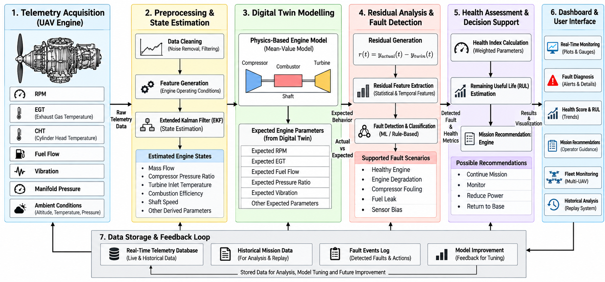

# SKYNEX – AI-Powered UAV Health Monitoring & Digital Twin Platform

### Team PROTONOVA
**Smart India Hackathon (SIH) 2026**  
**Problem Code:** SIH26054

---

## Overview

SKYNEX is an AI-assisted Prognostics and Health Management (PHM) platform developed for UAV propulsion systems. The system combines real-time telemetry monitoring, digital twin simulation, fault diagnosis, health assessment, Remaining Useful Life (RUL) estimation, and mission-aware decision support.

The objective of SKYNEX is to help UAV operators identify developing faults before critical failure, improve mission safety, reduce unplanned maintenance, and support informed operational decisions.

---

## Problem Statement

UAV propulsion systems are vulnerable to faults such as engine degradation, compressor fouling, fuel system issues, and sensor anomalies. Traditional monitoring approaches rely mainly on threshold-based alarms, which often identify problems only after performance has already degraded.

SKYNEX addresses this challenge by continuously analyzing telemetry data, comparing actual system behavior with a digital twin model, detecting abnormal conditions, assessing system health, and providing actionable recommendations to operators.

---

## Key Features

- Real-Time UAV Telemetry Monitoring
- Digital Twin Based Health Assessment
- Residual-Based Fault Detection
- Fault Classification Engine
- Health Score Computation
- Remaining Useful Life (RUL) Estimation
- Mission Recommendation System
- Fleet Health Monitoring
- Interactive Judge Demonstration Mode
- Web-Based Mission Control Dashboard

---

## Supported Fault Scenarios

The current prototype supports the following fault conditions:

### Healthy Engine
Nominal engine operation with all parameters within expected limits.

### Engine Degradation
Simulates progressive mechanical wear leading to performance degradation.

### Compressor Fouling
Represents efficiency loss caused by contamination and airflow restrictions.

### Fuel Leak
Simulates abnormal fuel consumption and fuel system performance degradation.

### Sensor Bias
Represents sensor drift and measurement inaccuracies while the physical system remains unchanged.

---

## System Architecture

> Insert architecture image below after uploading it into the repository.



---

## System Workflow

```text
Telemetry Acquisition
          ↓
Data Processing
          ↓
EKF State Estimation
          ↓
Digital Twin Simulation
          ↓
Residual Generation
          ↓
Fault Detection
          ↓
Health Assessment
          ↓
RUL Estimation
          ↓
Mission Recommendation
```

---

## How SKYNEX Works

### 1. Telemetry Acquisition
The system continuously receives telemetry data such as:

- RPM
- EGT
- CHT
- Fuel Flow
- Vibration
- Pressure
- Environmental Parameters

### 2. Digital Twin Simulation
A physics-based digital twin estimates the expected engine behavior under current operating conditions.

### 3. Residual Analysis
The system compares actual telemetry against expected digital twin outputs and calculates residuals.

### 4. Fault Detection
Abnormal residual patterns are analyzed to identify potential faults.

### 5. Health Assessment
A health index is generated to represent the overall condition of the propulsion system.

### 6. Remaining Useful Life (RUL)
The platform estimates the remaining operational life before maintenance intervention becomes necessary.

### 7. Mission Decision Support
SKYNEX provides operational recommendations to assist UAV operators during missions.

---

## Dashboard Capabilities

The Mission Control Dashboard includes:

### Command Center
- System Overview
- Health Monitoring
- Mission Status

### Telemetry Monitoring
- Live Sensor Visualization
- Trend Analysis
- Performance Tracking

### Digital Twin
- Actual vs Expected Comparison
- Residual Monitoring
- Twin-Based Diagnostics

### Diagnosis Module
- Fault Classification
- Health Assessment
- Condition Awareness

### Fleet Monitoring
- Multi-UAV Overview
- Fleet Health Status
- Asset Visibility

### Analytics
- Historical Trends
- Performance Analysis
- Maintenance Insights

### Replay System
- Historical Mission Playback
- Event Investigation
- Fault Review

---

## Technology Stack

### Frontend
- React
- Vite
- JavaScript
- Plotly

### Backend
- FastAPI
- Python

### Analytics & PHM
- Digital Twin Modeling
- Extended Kalman Filter (EKF)
- Residual Analysis
- Health Assessment Logic
- RUL Estimation

### Deployment
- Render
- Vercel

---

## Repository Structure

```text
SKYNEX/
│
├── backend/
│   ├── api/
│   ├── twin/
│   └── services/
│
├── frontend/
│   ├── src/
│   ├── components/
│   ├── pages/
│   └── layouts/
│
├── docs/
│   └── architecture.png
│
└── README.md
```

---

## Current Prototype Scope

The current implementation demonstrates:

- Live telemetry simulation
- Digital twin workflow
- Fault scenario simulation
- Health score tracking
- Mission recommendations
- Fleet monitoring concepts
- Interactive dashboard interfaces

The platform is intended as a prototype demonstration for Smart India Hackathon evaluation and technology validation.

---

## Team PROTONOVA

- P Sai Bharath
- Nitya
- Sowmya
- Shravanth
- Abhiram
- Sai Bharath S

---

## Vision

To develop an intelligent UAV health management platform capable of supporting predictive maintenance, improving mission reliability, and enabling safer UAV operations through real-time diagnostics and digital twin technology.

---

**SKYNEX – AI-Powered UAV Health Monitoring & Digital Twin Platform**
